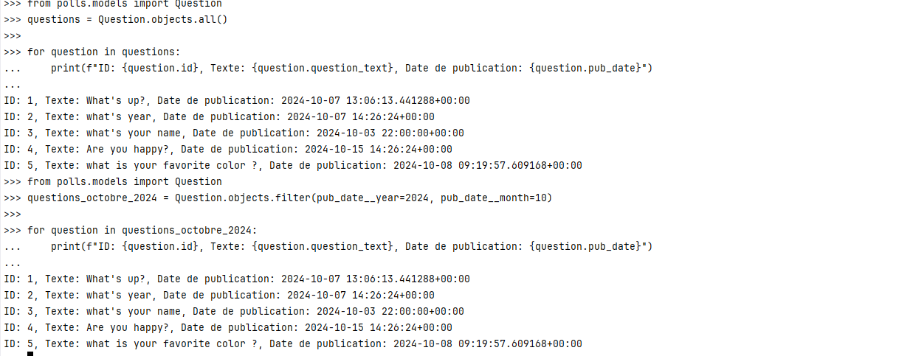
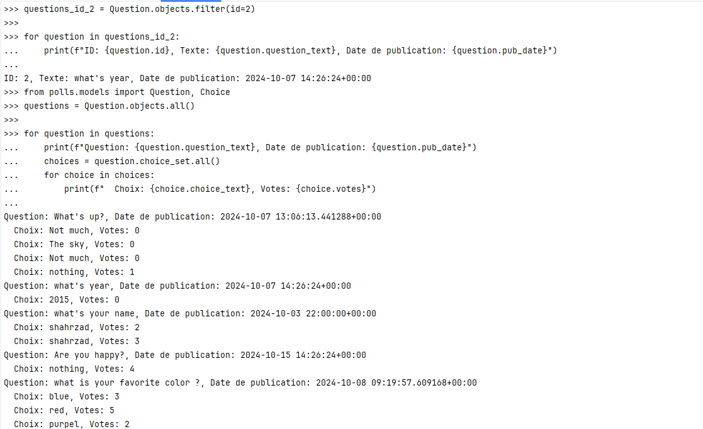
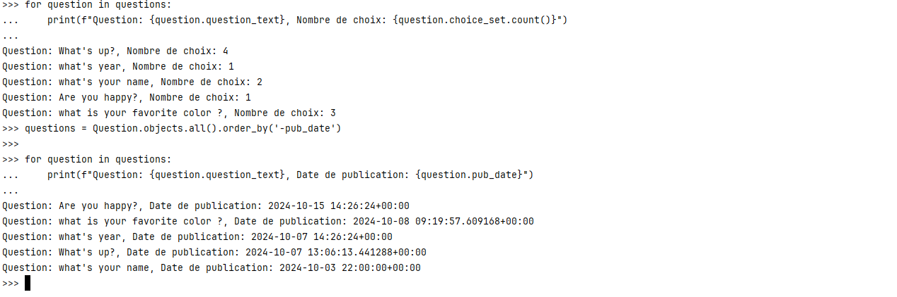
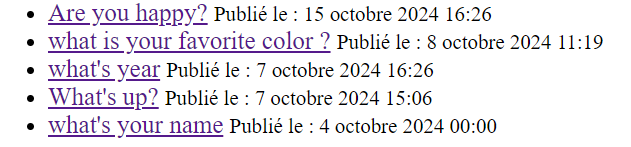
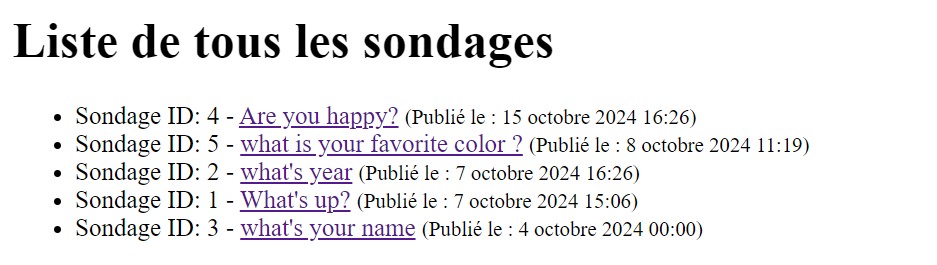
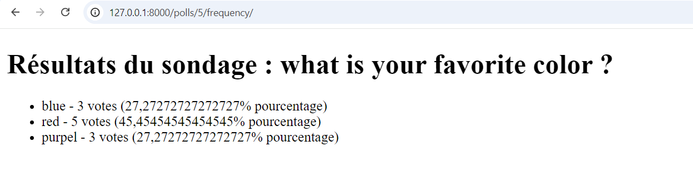
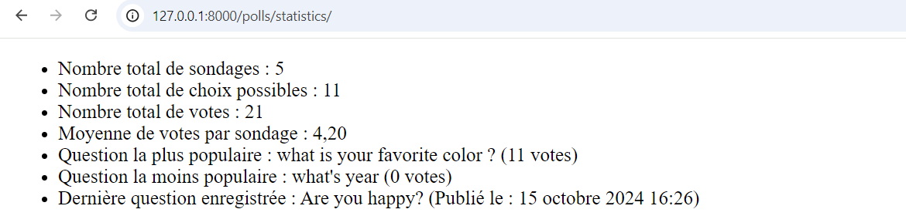
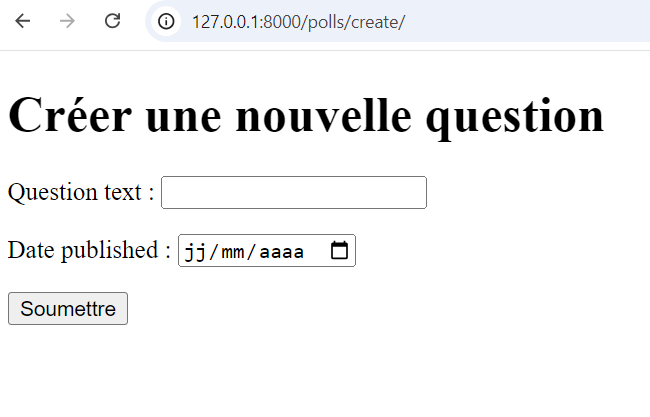
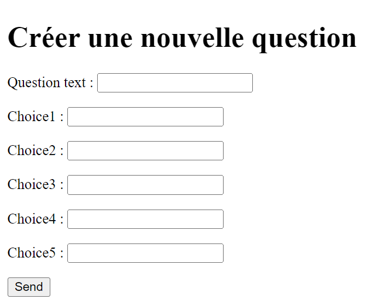

## 1. Admin.py

```python
admin.site.register(Choice)
```

## 2. Image
## 3.OUI     

## 4. Class QuestionAdmin

```python
class QuestionAdmin(admin.ModelAdmin):
    list_display = ('question_text', 'pub_date')
    list_filter = ('pub_date',)
    ordering = ('pub_date',)
    search_fields = ('question_text',)

admin.site.register(Question, QuestionAdmin)
```

### (5-7): Oui

__________________________________________________________________________________________________

## 2.2.2

### 1. Fetch all questions:

```python
from polls.models import Question
questions = Question.objects.all()

for question in questions:
    print(f"ID: {question.id}, Texte: {question.question_text}, Date de publication: {question.pub_date}")
```

____________________________________________________________________________________________

### 2. Fetch questions from October 2024:

```python
from polls.models import Question
questions_octobre_2024 = Question.objects.filter(pub_date__year=2024, pub_date__month=10)

for question in questions_octobre_2024:
    print(f"ID: {question.id}, Texte: {question.question_text}, Date de publication: {question.pub_date}")
```

---------------------------------------------------------------------------------------------

### 3. Fetch question with ID = 2:

```python
from polls.models import Question
questions_id_2 = Question.objects.filter(id=2)

for question in questions_id_2:
    print(f"ID: {question.id}, Texte: {question.question_text}, Date de publication: {question.pub_date}")
```

--------------------------------------------------------------------------------------------

### 4. Fetch questions with their choices:

```python
from polls.models import Question, Choice
questions = Question.objects.all()

for question in questions:
    print(f"Question: {question.question_text}, Date de publication: {question.pub_date}")
    choices = question.choice_set.all()
    for choice in choices:
        print(f"  Choix: {choice.choice_text}, Votes: {choice.votes}")
```

---------------------------------------------------------------------------------------------

### 5. Fetch questions and the number of choices:

```python
for question in questions:
    print(f"Question: {question.question_text}, Nombre de choix: {question.choice_set.count()}")
```

--------------------------------------------------------------------------------------------

### 7. Fetch all questions ordered by publication date:

```python
questions = Question.objects.all().order_by('-pub_date')

for question in questions:
    print(f"Question: {question.question_text}, Date de publication: {question.pub_date}")
```

---------------------------------------------------------------------------------------------

### 9. Create a new question:

```python
from polls.models import Question, Choice
from django.utils import timezone
import datetime

new_question = Question(question_text="what is your favorite color ?", pub_date=timezone.now())
new_question.save()
```

_________________________________________________________________________________________

### 10. Create choices for the new question:

```python
choice1 = Choice(question=new_question, choice_text="blue", votes=0)
choice1.save()

choice2 = Choice(question=new_question, choice_text="red", votes=3)
choice2.save()

choice3 = Choice(question=new_question, choice_text="purple", votes=0)
choice3.save()
```

----------------------------------------------------------------------------

### 11. Fetch recent questions:

```python
recent_questions = Question.objects.filter(pub_date__gte=timezone.now() - datetime.timedelta(days=1))

for question in recent_questions:
    print(f"Question: {question.question_text}, Date de publication: {question.pub_date}")
```

_____________________________________________________________________________________________

## 3.1: Index.html

```html
<li><a href="">{{ question.question_text }}</a>
<small>Publié le : {{ question.pub_date }}</small></li>
```




-------------------------------------------------------

## 3.2: In polls/views.py

```python
class AllPollsView(generic.ListView):
    template_name = 'polls/all_polls.html'
    context_object_name = 'all_questions'

    def get_queryset(self):
        '''Retourne tous les sondages classés par date de publication'''
        return Question.objects.order_by("-pub_date")
```

## In urls.py:

```python
path('all/', views.AllPollsView.as_view(), name='all_polls'),
```

Create an HTML file:

```html
<h1>Liste de tous les sondages</h1>


    <ul>
    
        <li>
            Sondage ID: {{ question.id }} -
            <a href="">{{ question.question_text }}</a>
            <small>(Publié le : {{ question.pub_date }})</small>
        </li>
    
    </ul>

    <p>Aucun sondage disponible.</p>

```



---------------------------------------------------------------------------------

## 3.3: In views.py:

```python
class FrequencyView(generic.DetailView):
    model = Question
    template_name = "polls/frequency.html"
    pk_url_kwarg = 'question_id'

    def get_context_data(self, **kwargs):
        context = super().get_context_data(**kwargs)
        question = self.get_object()
        context['choices'] = question.get_choices()
        return context
```

## In urls.py:

```python

 path('<int:question_id>/frequency/', views.FrequencyView.as_view(), name='frequency'),
 
```
##  In frequency.html:


```html
<h1>Résultats du sondage : {{ question.question_text }}</h1>

<ul>
    
        <li>{{ choice.choice_text }} - {{ votes }} ({{ percent }}%)</li>
    
</ul>

```
# modifiy all_polls.html: 

```html
 <a href="">{{ question.question_text }}</a>
```
## In models.py (class question): 
```python

        def get_choices(self):
        choices = self.choice_set.all()
        total_votes = sum(choice.votes for choice in choices)
        results = []
        for choice in choices:
            votes = choice.votes
            percent = (votes / total_votes * 100) if total_votes > 0 else 0
            results.append((choice, votes, percent))
        return results
```

---------------------------------------------------------------------------------------
## 3.4: 
## In models.py (class question): 
```python
from django.db.models import Sum

    def total_questions(cls):

        return cls.objects.count()

    @classmethod
    def total_choices(cls):

        return sum(choice.choice_set.count() for choice in cls.objects.all())

    @classmethod
    def total_votes(cls):

        return sum(choice.votes for question in cls.objects.prefetch_related('choice_set').all() for choice in
                   question.choice_set.all())

    @classmethod
    def average_votes(cls):

        total_votes = cls.total_votes()
        total_questions = cls.total_questions()
        return total_votes / total_questions if total_questions > 0 else 0

    @classmethod
    def most_popular(cls):
        
        return cls.objects.annotate(total_votes=Sum('choice__votes')).order_by('-total_votes').first()

    @classmethod
    def least_popular(cls):

        return cls.objects.annotate(total_votes=Sum('choice__votes')).order_by('total_votes').first()

    @classmethod
    def latest_question(cls):

        return cls.objects.latest('pub_date')


```
##  In views.py:
```python

def statistics_view(request):
    total_questions = Question.total_questions()
    total_choices = Question.total_choices()
    total_votes = Question.total_votes()
    average_votes = Question.average_votes()
    most_popular = Question.most_popular()
    least_popular = Question.least_popular()
    latest_question = Question.latest_question()

    context = {
        'total_questions': total_questions,
        'total_choices': total_choices,
        'total_votes': total_votes,
        'average_votes': average_votes,
        'most_popular': most_popular,
        'least_popular': least_popular,
        'latest_question': latest_question,
    }
    return render(request, 'polls/statistics.html', context)
```
## In urls.py:
```python
 path('statistics/', views.statistics_view, name='statistics'),
```
## in statistics.html : 

```html
<ul>
    <li>Nombre total de sondages : {{ total_questions }}</li>
    <li>Nombre total de choix possibles : {{ total_choices }}</li>
    <li>Nombre total de votes : {{ total_votes }}</li>
    <li>Moyenne de votes par sondage : {{ average_votes|floatformat:2 }}</li>
    <li>Question la plus populaire : {{ most_popular.question_text }} ({{ most_popular.total_votes }} votes)</li>
    <li>Question la moins populaire : {{ least_popular.question_text }} ({{ least_popular.total_votes }} votes)</li>
    <li>Dernière question enregistrée : {{ latest_question.question_text }} (Publié le : {{ latest_question.pub_date }})</li>
</ul>
```

-------------------------------------------------------------------------------------------------
## in forms.py:
```python
 
from django import forms
from .models import Question

class QuestionForm(forms.ModelForm):
    class Meta:
        model = Question
        fields = ['question_text', 'pub_date']
        widgets = {
            'question_text': forms.TextInput(attrs={'class': 'form-control'}),
            'pub_date': forms.DateInput(attrs={'type': 'date', 'class': 'form-control'}),
        }
```
## in wiews.py:

```python 
def create_question(request):
    if request.method == "POST":
        form = QuestionForm(request.POST)
        if form.is_valid():
            form.save()
            return redirect('polls:index')  
    else:
        form = QuestionForm()
    return render(request, 'polls/create_question.html', {'form': form})
```
## in urls.py
```python 
path('create/', views.create_question, name='create_question'),
```
##  create_question.html:

```html
<!DOCTYPE html>
<html lang="fr">
<head>
    <meta charset="UTF-8">
    <meta name="viewport" content="width=device-width, initial-scale=1.0">
    <title>Créer une Question</title>
</head>
<body>
    <h1>Créer une nouvelle question</h1>
    <form method="post">
        
        {{ form.as_p }}
        <button type="submit" class="btn btn-primary">Soumettre</button>
    </form>
</body>
</html>
```

-------------------------------------------------------------------------------------------------
## 5.2: in forms.py: 

```python 
from django import forms
from .models import Question, Choice

class QuestionForm(forms.ModelForm):
    choice1 = forms.CharField(max_length=200, required=True)
    choice2 = forms.CharField(max_length=200, required=True)
    choice3 = forms.CharField(max_length=200, required=False)
    choice4 = forms.CharField(max_length=200, required=False)
    choice5 = forms.CharField(max_length=200, required=False)

    class Meta:
        model = Question
        fields = ['question_text']

    def save(self, commit=True):
        question = super().save(commit)

        if commit:
            choices = [
                self.cleaned_data['choice1'],
                self.cleaned_data['choice2'],
                self.cleaned_data['choice3'],
                self.cleaned_data['choice4'],
                self.cleaned_data['choice5'],
            ]
            for choice in choices:
                if choice:
                    Choice.objects.create(question=question, choice_text=choice)
        return question
```

------------------------------------------------------------------------------------------------------
